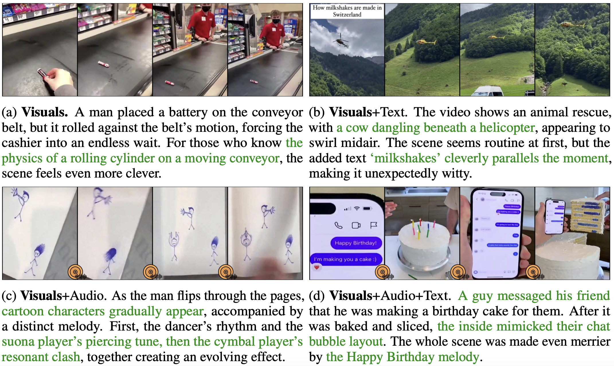
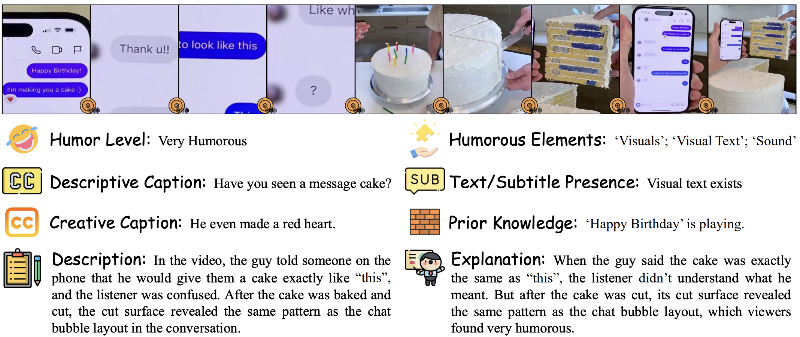

# V-HUB: A VISUAL-CENTRIC HUMOR UNDERSTANDING BENCHMARK FOR VIDEO LLMS

<div style="text-align: center">
  <a href="https://arxiv.org/pdf/2509.25773"></a>
  <a href="https://huggingface.co/datasets/Foreverskyou/v-HUB"></a>
  <a href="https://github.com/spatigen/vhub"></a>
  <a href="https://spatigen.github.io/vhub.io/"></a>
</div>

## 📗 Overview

AI models capable of comprehending humor hold real-world promise—for example, enhancing engagement in human-machine interactions. To gauge and diagnose the capacity of multimodal large language models (MLLMs) for humor understanding, we introduce <strong>v-HUB</strong>, a novel **visual-centric video humor understanding** benchmark. v-HUB comprises a curated collection of minimally verbal short videos, sourced from classic silent films and online resources, and reflecting real-world scenarios where humor can be appreciated purely through visual cues. Each video clip is paired with rich annotations, including captions, descriptions, and explanations, supporting evaluation tasks like **caption matching** and **humor explanation**. To broaden its applicability, we further construct an **open-ended video QA** task, making it readily integrable into existing video understanding benchmarks. We evaluate a diverse set of MLLMs, from specialized Video-LLMs to versatile OmniLLMs that can process audio, covering both open-source and proprietary domains. The experimental results expose the difficulties MLLMs face in comprehending humor from visual cues alone. For example, all models exhibit a marked performance drop on caption matching when moving from text-based to video-based evaluation (without audio). Our findings also demonstrate that incorporating audio helps with video humor understanding, highlighting the informativeness of sound and the promise of integrating richer modalities for complex video understanding tasks.

<p align="center">
    
</p>

## 📐 Dataset Examples

<p align="center">
    
</p>

## 🔍 Dataset

**License**:
```
v-HUB is only used for academic research. Commercial use in any form is prohibited.
The copyright of all videos belongs to the video owners.
If there is any infringement in v-HUB, please email shi_zpeng@sjtu.edu.cn and we will remove it immediately.
Without prior approval, you cannot distribute, publish, copy, disseminate, or modify v-HUB in whole or in part. 
You must strictly comply with the above restrictions.
```

Please send an email to **shi_zpeng@sjtu.edu.cn**. 🌟

## 🔮 Data Curation and Evaluation Pipeline

<p align="center">
    
</p>

### 📍 Filtering

We deploy the Whisper model and only retain videos with less than 10 characters.

```bash
python ./filter/extract_speech_text.py
```

### 📍 Annotation

Our annotation platform is Label Studio, please refer to [Annotation_Manual](https://github.com/spatigen/vhub/tree/main/Annotation_Manual) and [Label Studio](https://github.com/HumanSignal/label-studio) for setting up the platform.

### 📍 Evaluation

**Step 1: Get the Code and Data**

```bash
git clone https://github.com/spatigen/vhub.git
cd vhub
# Make sure git-lfs is installed (https://git-lfs.com)
git lfs install
git clone https://huggingface.co/datasets/Foreverskyou/v-HUB
```

**Step 2: Configure and Run**

1.  **Prepare Data:** Unzip the `all_data.zip` file located in the dataset directory you just cloned. This will create an `all_data` folder.

2.  **Update Paths:** Open the evaluation script you wish to use (e.g., `./scripts/Text_Only/example_QA.sh`). Update the `VIDEO_DIR`, `QUESTIONS_CSV` and `CAND_FILE` variables to the absolute paths of your dataset files.

3.  **Run Evaluation:** After updating variables and installing the necessary dependencies for the model, try to execute the script.

```bash
./scripts/Text_Only/example_QA.sh
```

Here we provide example scripts for the three tasks under the three settings: Text-Only, Video-Only, and Video+Audio.

You can specify different tasks, such as: `['QA','explanation','matching']`. And you can also specify different models, for example:`['Qwen2.5-Omni','Qwen2.5-VL','Gemini2.5-flash','GPT-4o','InterVL 3.5','Minicpm 2.6-o','video SALMONN 2']`

## 📮 Contact
If you have any questions, please feel free to contact us:

[shi_zpeng@sjtu.edu.cn](mailto:shi_zpeng@sjtu.edu.cn)

[lihengli@stu.pku.edu.cn](mailto:lihengli@stu.pku.edu.cn)

[yannzhao.ed@gmail.com](mailto:yannzhao.ed@gmail.com)

## :black_nib: Citation

If you find our work helpful for your research, please consider citing our work. 

```bibtex
@article{shi2025v,
  title={V-HUB: A Visual-Centric Humor Understanding Benchmark for Video LLMs},
  author={Shi, Zhengpeng and Li, Hengli and Zhao, Yanpeng and Zhou, Jianqun and Wang, Yuxuan and Cui, Qinrong and Bi, Wei and Zhu, Songchun and Zhao, Bo and Zheng, Zilong},
  journal={arXiv preprint arXiv:2509.25773},
  year={2025}
}
```
